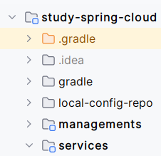

# study-spring-cloud

Spring Cloud를 공부하기 위한 목적의 레포지토리입니다. 다음 강의를 참고 중입니다.

- [Udemy - Master Microservices with Spring Boot and Spring Cloud](https://www.udemy.com/course/microservices-with-spring-boot-and-spring-cloud/)

# 디렉토리 구조

- local-config-repo : 각 모듈 앱에 대한 config 파일을 저장하는 서브 저장소 (private repo)
- managements : spring boot cloud 관련 모듈 구성
- services : spring boot를 사용한 개발 services 관련 모듈 구성

# 실행 방법

1. gradle 도커 플러그인으로 각 모듈에 대한 도커 이미지를 만들어줍니다.
   ```
   $ ./gradlew docker
   ```
2. docker-compose를 실행합니다.
   ```
   $ docker compose up -d
   ```
